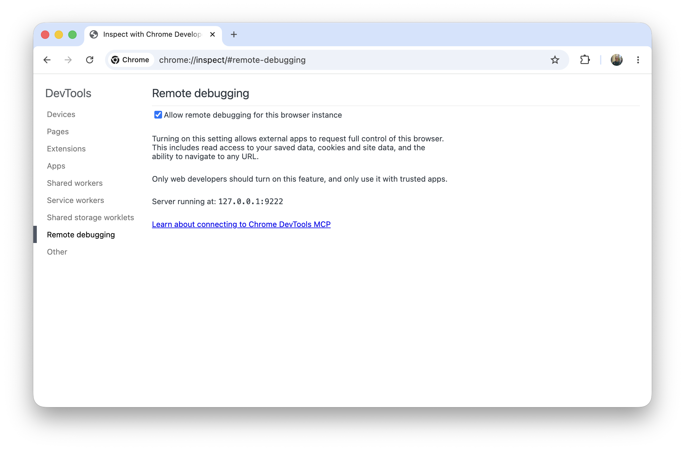
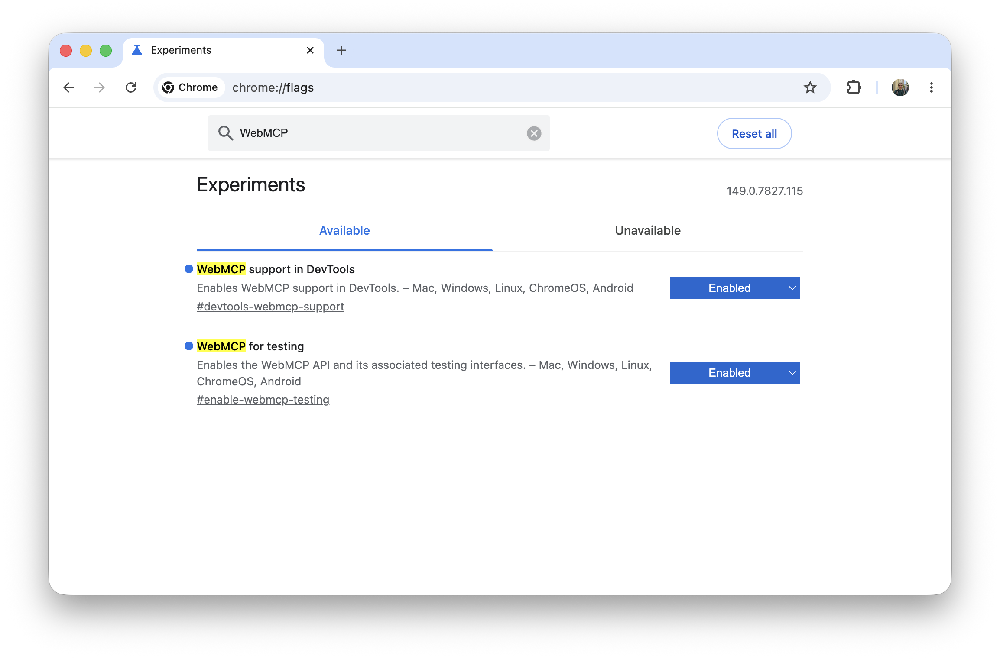
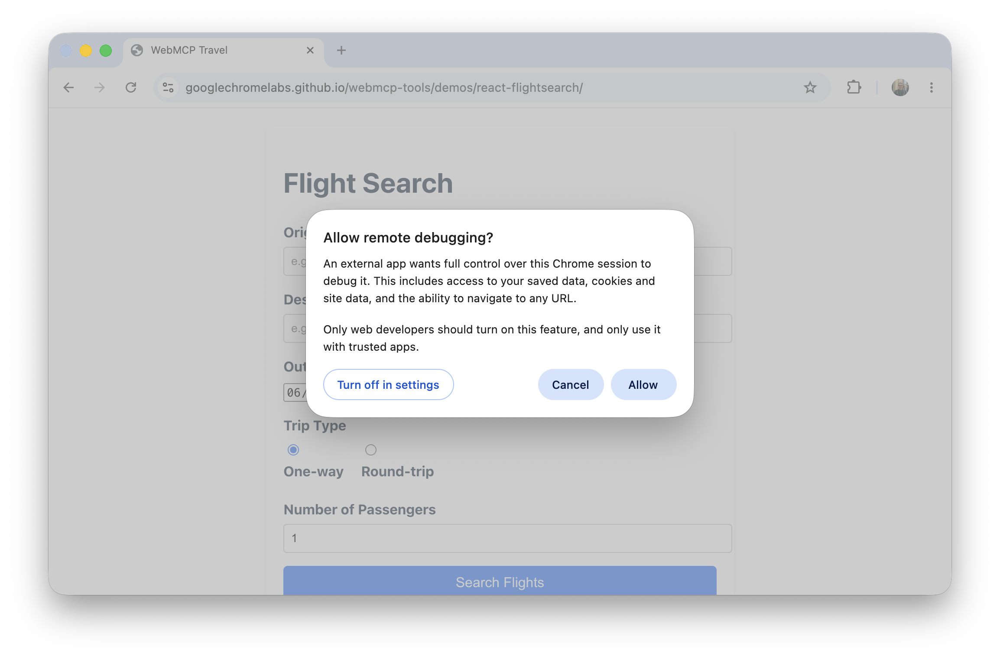

# pi-webmcp

A [Pi](https://pi.dev/) extension that connects Pi to webpages that register [WebMCP](https://github.com/webmachinelearning/webmcp) tools.

> [!IMPORTANT]
> Both the WebMCP specification and Chrome’s implementation are in active development. Anticipate breaking changes that affect this extension.

> [!CAUTION]
> This extension can pose a security risk in its default operating mode once the `/webmcp` command is run. A malicious webpage could poison the running Pi session’s context via its WebMCP tool instructions.
>
> Use at your own risk. Consider setting `allowedOrigins` to restrict which webpages Pi can connect to.

## First-time Setup

1. Install this extension via npm.

   ```sh
   pi install npm:pi-webmcp
   ```

2. Enable Chrome remote debugging by visiting [`chrome://inspect/#remote-debugging`](chrome://inspect/#remote-debugging).

  

3. Enable the relevant Chrome flags for WebMCP.

   - [`chrome://flags/#devtools-webmcp-support`](chrome://flags/#devtools-webmcp-support)
   - [`chrome://flags/#enable-webmcp-testing`](chrome://flags/#enable-webmcp-testing)

  

## Usage

1. Run `/webmcp` and accept the once-per-session confirmation prompt in Chrome.

  

2. Navigate to a WebMCP-capable page, such as Chrome Lab’s [WebMCP Travel](https://googlechromelabs.github.io/webmcp-tools/demos/react-flightsearch/) demo.

   More can be found [here](https://github.com/GoogleChromeLabs/webmcp-tools).

## Options

| Option | Description |
|--------|-------------|
| allowedOrigins | When specified, Pi will only discover and connect to WebMCP tools from these origins. |
| disallowOrigins | When specified, Pi will not discover or connect to WebMCP tools from these origins. |

## Browser Support

WebMCP is currently only implemented in Chrome, so this extension is scoped to Chromium-based browsers for now. We plan to support additional browsers if / when they implement WebMCP.
